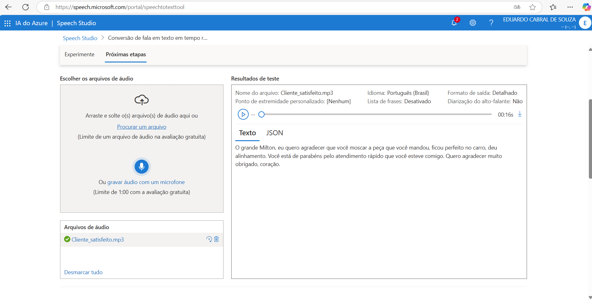
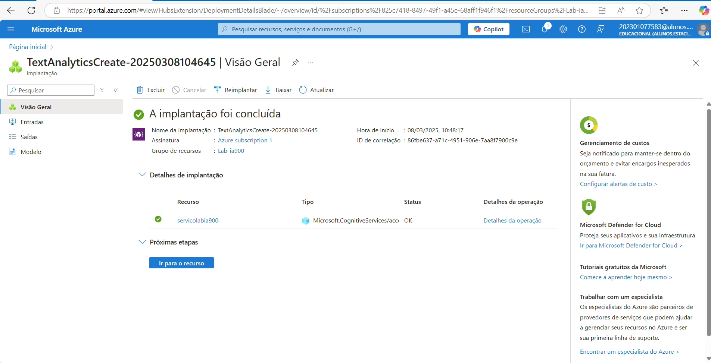
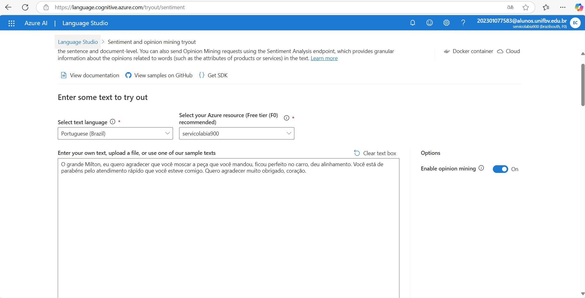
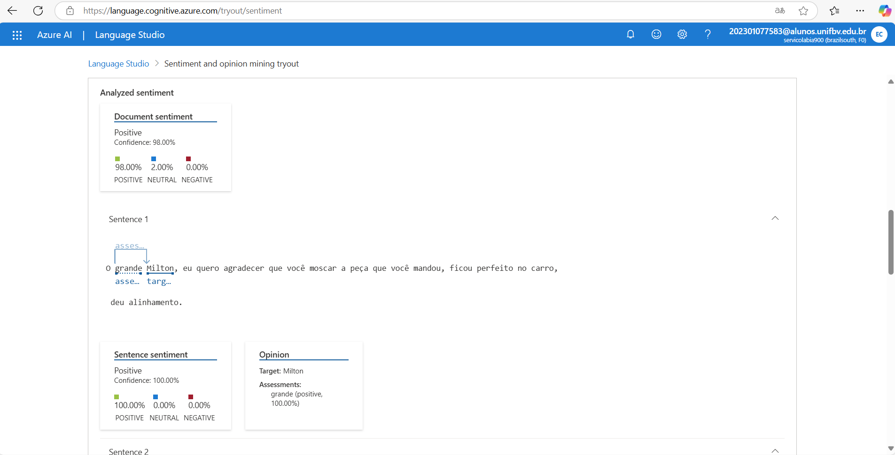
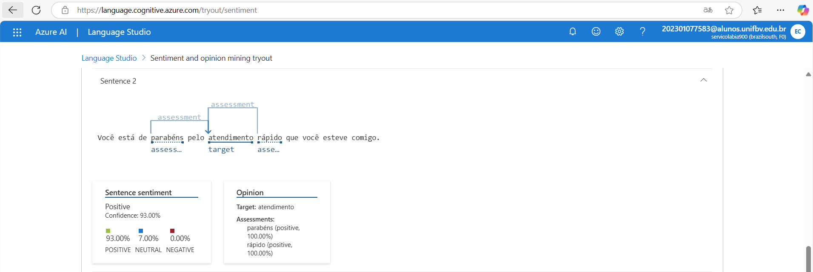
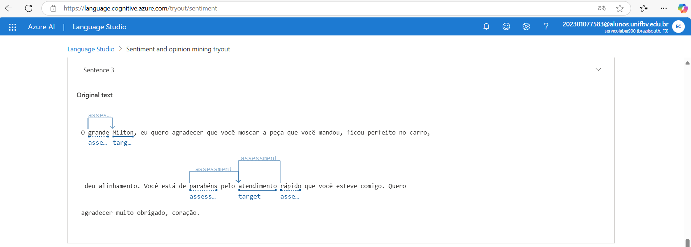
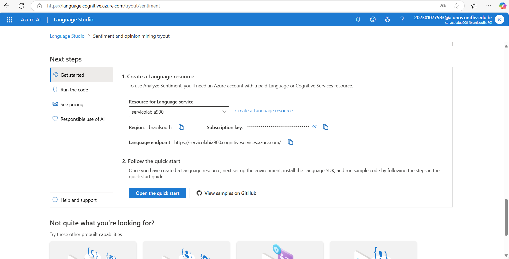

# Análise de Sentimentos com Language Studio no Azure AI
Projeto de Análise de Sentimentos com Language Studio no Azure AI

## Descrição do Projeto
Este repositório contém o processo de análise de sentimentos realizado utilizando o **Language Studio** da **Azure AI**. A análise foi feita sobre um conjunto de sentenças relacionadas a experiências de usuários com produtos e serviços.

## Processo
1. **Preparação dos Dados**: 
   - As sentenças foram coletadas e organizadas na pasta `inputs`.
   
2. **Uso do Language Studio**:
   - O Azure Language Studio foi utilizado para realizar a análise de sentimentos das sentenças.
   - A ferramenta fornece uma pontuação de sentimento, indicando se o sentimento é positivo, negativo ou neutro.

3. **Análise dos Resultados**:
   - A análise revelou que as sentenças sobre produtos tiveram uma predominância de sentimentos positivos.
   - Sentenças relacionadas a serviços e atendimento ao cliente tiveram sentimentos mais negativos.

## Insights e Possibilidades
- **Insights**:
  - O uso de IA para análise de sentimentos pode ajudar empresas a entender rapidamente o feedback dos clientes, identificando áreas que precisam de melhorias.
  - Ferramentas como o Azure Language Studio podem ser altamente eficazes para automatizar a classificação de sentimentos em grandes volumes de dados.

- **Possibilidades**:
  - Melhorar o atendimento ao cliente ao identificar feedbacks negativos em tempo real.
  - Implementar soluções para análise de sentimentos em campanhas de marketing para adaptar a comunicação com o público.
  - Analisar comentários de usuários em redes sociais ou fóruns para entender melhor a percepção sobre uma marca ou produto.

## Prints e Resultados

----

----

----

----

----

----

